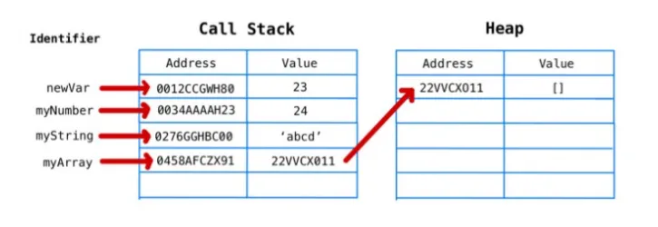

### Lessonon-2 

— Javascript data types: [ boolean, null , undefined , Symbol , BigInteger , Object ] +
- CallStack & Heap (Advanced) +
- Truthy , Falthy
- Opertaors (logical operators , || , && , == , === , !== , !=)
- String

### Data types in Javascript

1. Primitive types

- String +
- Number +
- Boolean + [ true , false]
- undefined +
- null   +
- Symbol +
- BigInt +

2. Refrence (Non-Primitive) types 

https://pashazade-nazar.medium.com/memory-life-cycle-heap-stack-call-stack-string-pool-bba2569524cb

- Object

##  Truthy , Falthy

### Truthy

- 1 , 2, 3 ..., -2 , 1 , -0.111,
- "salom" , "a" , "   ",
- true 
- [],
- {}

### Falthy

- 0
- ""
- false
- null
- undefined

