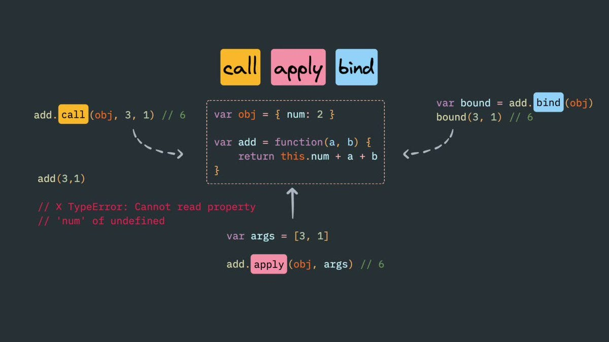
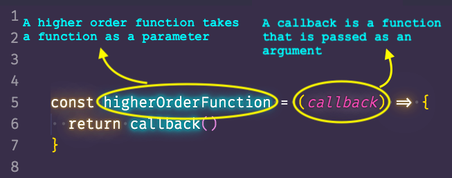

# module1

#### lesson8

1. "this" keyword
2. function Constructor
3. call , aplly , bind
4. HOF -> Higher orderd function

## Built in function

0. forEach
1. map
2. filter
3. reduce
   ....

   ### reference

   
   
